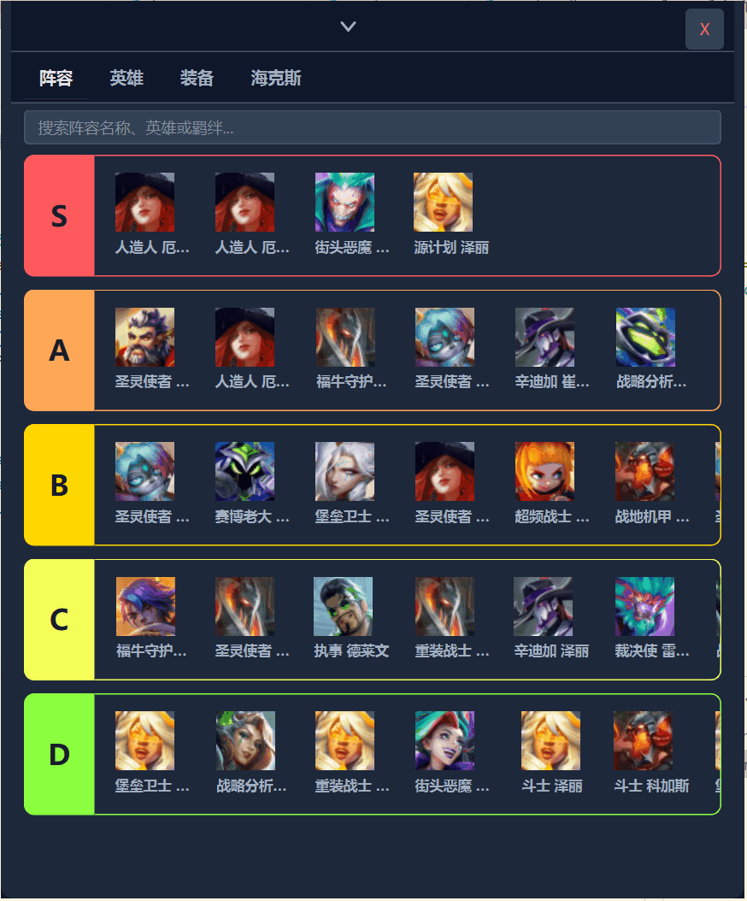
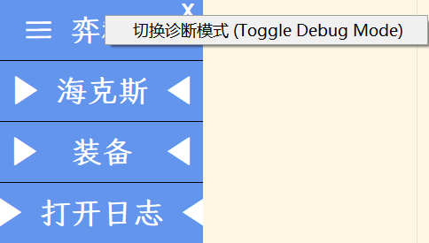
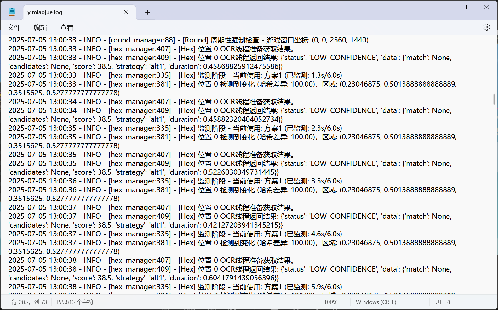
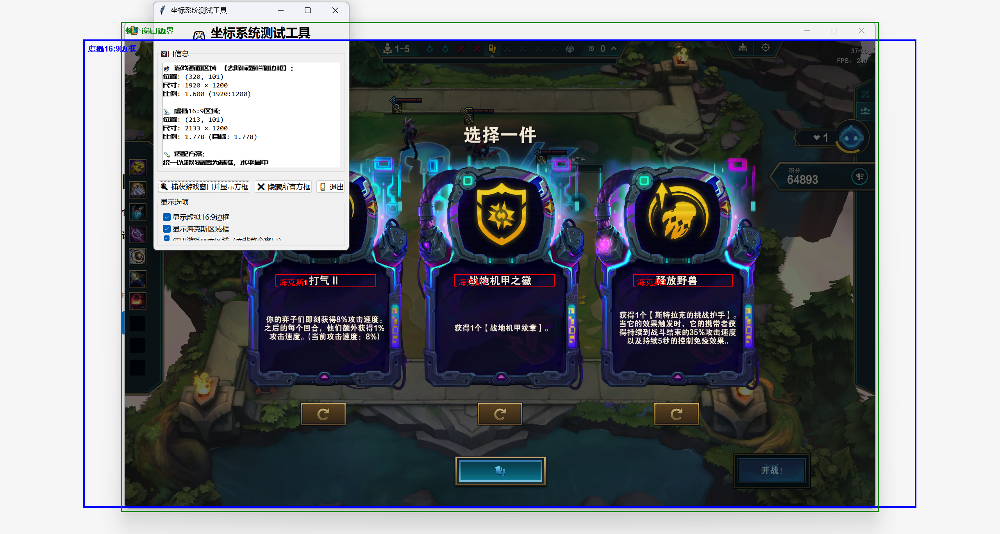
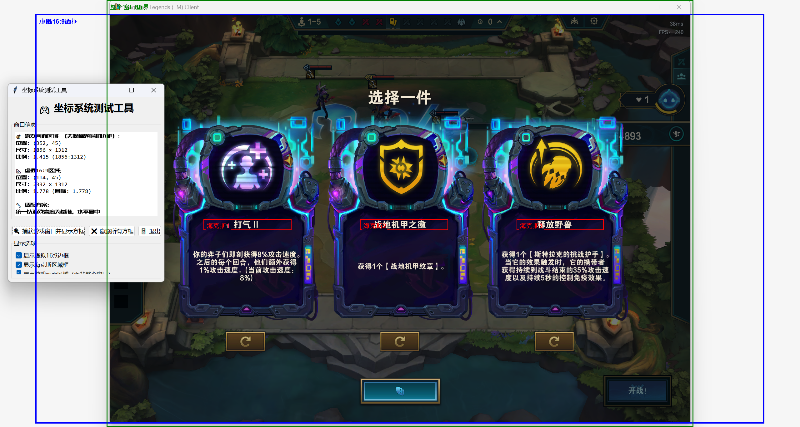
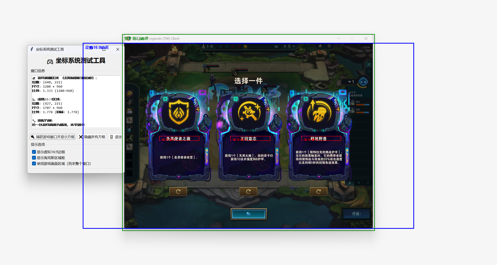
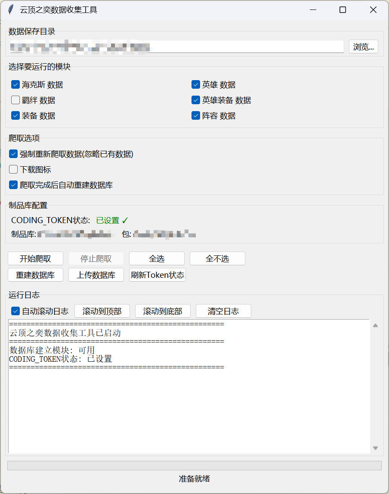
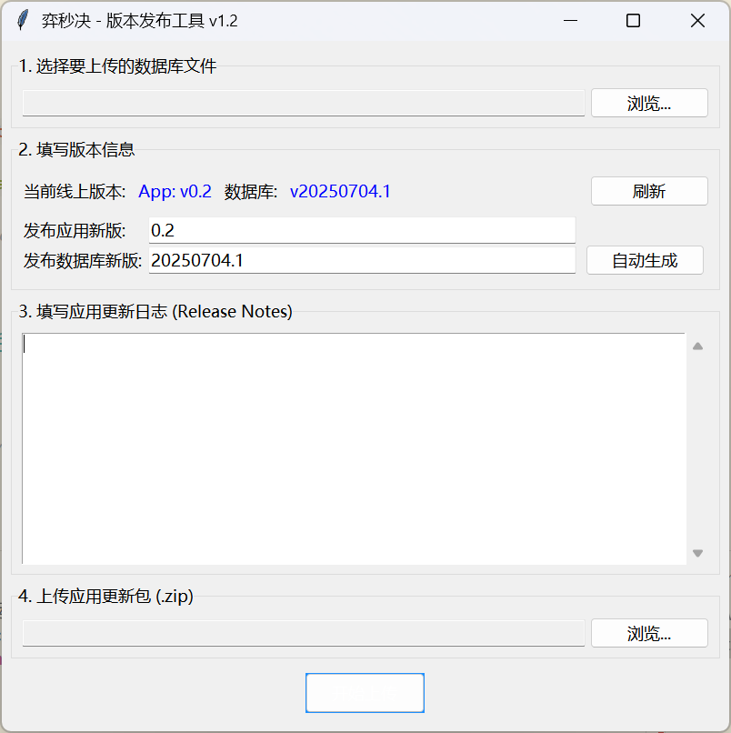

# 项目案例："云顶助手"的质量保障与迭代之旅

## 功能演示 (Live Demo)

<!-- markdownlint-disable MD033 -->
<table>
  <tr>
    <td align="center" width="33%"><b>核心功能：常驻数据窗口</b></td>
    <td align="center" width="67%"><b>核心功能：对局内OCR助手</b></td>
  </tr>
  <tr>
    <td></td>
    <td></td>
  </tr>
</table>
<!-- markdownlint-enable MD033 -->

## 1. 项目概述：一次由"用户痛点"驱动的质量探索

> 我最初的痛点很简单：在玩《云顶之弈》时，需要频繁切屏去手动查找阵容资料，过程繁琐且容易在关键时刻出错。为了解决这个痛点，我决定开发一款能将核心信息直接展示在游戏屏幕上的助手工具。

本项目记录了我作为一个零编程基础的探索者，如何将一个想法变为现实，并在遭遇第一个真实用户的兼容性危机时，转变为一个"质量保障者"的全过程。

我独立主导了从**概念验证、缺陷发现、根因分析、到测试、发布及迭代维护**的全流程，最终的软件在一个超过30人的社群中稳定运行，并通过我搭建的自动化更新流程，持续保障着所有用户的体验。

---

## 2. 核心测试案例：攻坚复杂环境下的兼容性缺陷

### 2.1 前瞻性的测试策略：为未知环境设计的"诊断工具箱"

> 我很清楚，我仅在自己的电脑上进行了开发和测试，这种单一的环境直接发布，极有可能在用户多样化的屏幕分辨率下出现兼容性问题。

因此，我没有直接发布一个标准版，而是采取了**前瞻性的测试策略**：在软件的首次公开发布中，就为用户内置了一整套"诊断工具箱"，旨在高效地收集潜在问题的精准线索。

- **工具一：可视化诊断模式**
  用户在遇到问题时，通过右键菜单即可开启，用可视化的"红框"来暴露程序内部的坐标定位状态。

  <!-- markdownlint-disable-next-line MD033 -->
  

- **工具二：一键打开日志**
  除了可视化的红框，我还添加了"打开日志"按钮。用户可一键找到包含了程序关键运行节点和状态的日志文件，方便发送，为我深度分析提供依据。

  <!-- markdownlint-disable-next-line MD033 -->
  

### 2.2 策略见效：P0级缺陷的精准定位

我的前瞻策略很快就收到了成效。一位"带鱼屏"用户反馈软件完全失效，并遵照我的提前引导，直接发回了开启诊断模式后的截图。

这张截图提供了决定性的证据：红框的偏移让我**瞬间**将问题定性为"UI坐标定位错误"，而非"OCR引擎识别失败"，避免了在错误方向上的大量精力浪费，体现了内置诊断工具在高效沟通和精准定位上的巨大价值。

<!-- markdownlint-disable-next-line MD033 -->

*上图：用户发来的第一手反馈，直接暴露了坐标定位的根本问题。*

### 2.3 根本原因分析 (RCA) 与解决方案的健壮性验证

> 我发现，虽然游戏窗口在不同分辨率下布局会变，但核心UI区域的**实际高度和宽高比并未被拉伸，改变的只是它们与窗口边框的距离**。

基于这个观测，我设计了**虚拟16:9参考框**的动态定位方案，彻底解决了此问题：

1. **建立虚拟坐标系：** 以游戏窗口的实际高度作为"9"，动态计算出一个虚拟的"16:9"标准化屏幕范围。
2. **应用相对坐标：** 将原先只适用于标准16:9分辨率下的相对坐标，套用在这个虚拟参考框内。
3. **精准定位：** 最终，无论物理屏幕和窗口尺寸如何变化，程序都能在虚拟框内准确捕捉到目标OCR区域。

为了验证该方案的稳定性和健壮性，我编写了独立的测试脚本，在多种典型分辨率下进行了回归测试，确保方案的普适性。

<!-- markdownlint-disable MD033 -->
<table>
  <tr>
    <td align="center">测试环境一：1920x1200</td>
    <td align="center">测试环境二：1856x1312</td>
    <td align="center">测试环境三：1280x960</td>
  </tr>
  <tr>
    <td></td>
    <td></td>
    <td></td>
  </tr>
</table>
<!-- markdownlint-enable MD033 -->
*上图：虚拟参考框方案在不同分辨率下的自适应定位效果*

---

## 3. 从"救火"到"防火"：构建可持续的质量保障体系

在解决了这个核心缺陷后，我开始思考如何系统性地提升产品整体质量与可维护性。为此，我构建了一套独立的运维工具。

- **搭建一键式数据运维流水线：**
  我将所有零散的数据爬取脚本，通过父子进程调用的形式，集成到了一个独立的GUI运维页面。原先需要手动、依次执行的多个易错步骤，现在**一键即可完成，极大地降低了操作复杂度和出错风险，保障了核心数据的准确性与更新效率。**

  <!-- markdownlint-disable-next-line MD033 -->
  

- **实现独立的版本控制与发布：**
  我为软件构建了独立的版本管理与发布界面，用于控制版本号、上传数据库文件以及打包发布软件本身。**这确保了任何关键的缺陷修复和功能更新，都能在第一时间、可靠地推送给所有用户。**

  <!-- markdownlint-disable-next-line MD033 -->
  

- **实施模块化架构重构：**
  我主动将初期的"单体式架构"重构为"模块化"架构。**这极大地提升了软件的可测试性**——未来任何一个模块的修改，都可以在不影响其他模块的情况下进行独立的单元测试和回归测试。

---

## 4. 技术栈与工具

- **核心驱动：** 保障产品质量的责任心与对用户体验的极致追求。
- **AI协同伙伴：** Cursor (用于快速生成测试脚本、理解陌生技术概念、代码重构)。
- **主要技术栈：** Python, Tkinter, Pillow, PyWin32, Requests & BeautifulSoup4, SQLite3。
- **制品与版本管理：** CODING.net 制品库, 自建GUI发布工具。

---

## 5. 本项目所展现的核心能力

- **测试策略与用例设计：** 能够为模糊的质量问题，设计出具体的、可执行的、带有诊断机制的测试方案。
- **端到端的缺陷管理：** 具备从缺陷报告、复现、定性、根本原因分析、到修复验证和用户验收的完整闭环实践经验。
- **质量保障的工程化思维：** 不满足于被动修复，而是主动通过架构重构、自动化工具等工程化手段，系统性地提升产品的可测试性与长期质量。
- **卓越的用户同理心与沟通：** 始终将用户体验置于首位，并能通过有效沟通，将普通用户转化为高效的测试伙伴。

---

**关于我：** 本科毕业于安徽医科大学。在一个完全陌生的领域，出于对"让软件在用户手中完美运行"这一信念的执着，我自学并实践了软件质量保障的全过程。此项目是我个人在这方面能力与热情的最佳证明。
